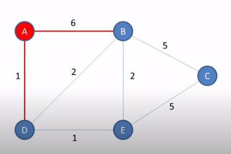

# 1 . 题目

成研访客

描述：访客来到成研办公场地，需要找到具体的到访区域。现各个区域间可到达关系已知、耗时已知，请为访客设计一条最省时的路径。例如，访客需访问普惠金融组，可选择多种路径：大厅->二楼电梯厅->B区->A区，大厅->二楼电梯厅->E区->D区->中部电梯->A区，大厅->二楼电梯厅->E区->D区->C区->A区等，其中，选择大厅->二楼电梯厅->B区->A区最快。

输入1：节点个数，节点按照字母顺序编号。

输入2：字符串表示，可达节点间耗时。

输入3：输入为访客当前位置。

输入4：访客目的地。

输出：输入最短耗时。如无路径输出字符串NONE。

示例：

输入1:8

输入2:a->b:4,b->h:1,b->e:2, e->d:1, h->g:1, h->c:2, g->f:2, g->c:5, f->c:2, c->d:1

输入3：a

输入4：d

输出：abed

解释：从a到d共有4种走法：a->b->e->d，耗时7；a->b->h->g->c->d，耗时9；a->b->h->g->f->c->d，耗时11；a->b->h->c->d，耗时8。可知第一种走法耗时最短，输出abed。

# 2.思路

（1）分析题目，已知节点个数以及不同节点之间的路径，给出初始节点与目的节点，求初始节点与目的节点之间的最短路径，如果存在则输出路径，不存在则输出NONE。可以很明显的看出来这是一个有权图中求单源最短路径的问题，而且不存在负边权，可以使用dijkstra算法，求出任何一个起点到终点的最短路径。
（2）dijkstra算法的基本思想：首先构建一个邻接矩阵，初始化为一个尽量大的数，标识不可达（如MAX=1000000），用来记录节点之间的路径关系，然后根据题目条件设置邻接矩阵，比如a->b:4，那么邻接矩阵matrix[0][1]=4。
（3）构建完邻接矩阵后，再新建一个dis数组、一个pre数组、一个visited数组，分别代表源节点到各个节点的最短路径值，到达最短路径值的前驱节点、节点是否被访问。
（4）初始化dis数组为MAX，代表都不可达
（5）初始化pre数组为自身节点,pre[i]=i。
（6）初始化visited数组为FALSE，代表都未被访问
（7）算法开始，从源节点start开始，dis[start]=0。
（8）从visited数组中找到未访问的节点{a,b,c,d,e,f,g,h}中dis最小的一个，很明显一开始是start节点遍历，如start=a,从a节点开始，将a节点设置visited数组为已访问节点u，遍历未访问节点v的邻接矩阵，找到一个最短耗时节点,如果通过这个节点中转后路径耗时更短的话，即dis[u] + matrix[u][v] < dis[v]，更新dis[v]，更新其前驱节点为u。
 (9)继续从未访问节点中遍历，找到未访问节点中路径耗时最小的，作为新的访问初始节点u，并将u设置visited数组为已访问，再遍历未访问节点v的邻接矩阵，找到一个最短耗时，如果通过这个节点中转后路径耗时更短的话，dis[u] + matrix[u][v] < dis[v]，更新dis[v]，更新其前驱节点为u。
（10） 直到遍历结束，得到一个计算后的dis数组和pre数组，可以查看源点到其他点的最短路径耗时，如果要查看最短路径，则由pre数组倒推可得到。
（11）算法结束

# 3. 代码

```
package com.lihaitao.algorithm;

import Java.util.Arrays;

/**
* Created by Administrator on 2020/7/8.
*/
public class ChengYanVisitor {
   public static int MAXV = 1000000;
   public static String getShortestPath(int iNodes, String strInitPath, String strStart, String strEnd){
       boolean[] visted = new boolean[iNodes];
       //构建邻接矩阵
       int[][] matrix = new int[iNodes][iNodes];
       for (int i = 0; i < iNodes; i++ ) {
           Arrays.fill(matrix[i],MAXV);
       }
       //最短距离表
       int[] dis = new int[iNodes];
       Arrays.fill(dis,MAXV);
       //前驱节点
       int[] pre  = new int[iNodes];
       //邻接矩阵初始化
       String[] path = strInitPath.split(",");
       for (int i = 0 ; i < path.length; i++) {
           matrix[path[i].charAt(0)-'a'][path[i].charAt(3)-'a'] = Integer.valueOf(path[i].charAt(5)-'0');
       }
       for (int i = 0 ; i < iNodes; i++) {
           System.out.println("matrix is " + Arrays.toString(matrix[i]));
       }
       dis[Integer.valueOf(strStart.toCharArray()[0]-'a')] = 0;
       for (int i = 0; i < iNodes; i++) {
           //初始状态每个点前驱为自身
           pre[i] = i;
       }
       System.out.println("pre first is " + Arrays.toString(pre));
       for (int i = 0; i < iNodes; i++) {
           int u = -1, minn = MAXV;
           for (int j = 0; j < iNodes; j++) {
               if (visted[j] == false && dis[j] < minn) {
                   u = j;
                   minn = dis[j];
               }
           }
           if (u == -1) return "NONE";
           visted[u] = true;
           for (int v = 0; v < iNodes; v++) {
               if (visted[v] == false && dis[u] + matrix[u][v] < dis[v]) {
                   dis[v] = dis[u] + matrix[u][v];
                   pre[v] = u;
               }
           }
       }
       System.out.println("pre is " + Arrays.toString(pre));
       System.out.println("dis is " + Arrays.toString(dis));
       if (dis[Integer.valueOf(strEnd.toCharArray()[0]-'a')] != MAXV) {
           int i = Integer.valueOf(strEnd.toCharArray()[0]-'a');
           StringBuilder ans = new StringBuilder();
           ans.append(String.valueOf((char)(strEnd.toCharArray()[0])));
           while (pre[i] != Integer.valueOf(strStart.toCharArray()[0]-'a')) {
               ans.append(String.valueOf((char)(pre[i]+'a')));
               i = pre[i];
           }
           ans.append(String.valueOf((char)(pre[i]+'a')));
           return ans.reverse().toString();
       }
       return "NONE";
   }


   public static void main(String[] args) {
       ChengYanVisitor cy = new ChengYanVisitor();
       int iNodes;
       String strInitPath;
       String strStart;
       String strEnd;
       iNodes = 8;
       strInitPath = "a->b:4,b->h:1,b->e:2,e->d:1,h->g:1,h->c:2,g->f:2,g->c:5,f->c:2,c->d:1";
       strStart = "a";
       strEnd = "d";
       System.out.println("ans is " + cy.getShortestPath(iNodes,strInitPath,strStart,strEnd));
   }
}
```


# 4. 思路

可以参考此图理解




| vertex | shortest distance from a | previous |
| ------ | ------------------------ | -------- |
| A      | 0                        |          |
| B      | ∞                        |          |
| C      | ∞                        |          |
| D      | ∞                        |          |
| E      | ∞                        |          |

 请填充此表，就可以得出答案~