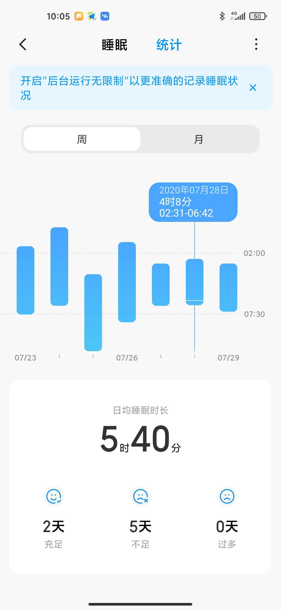
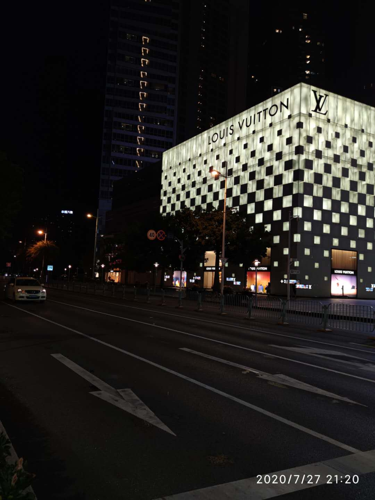
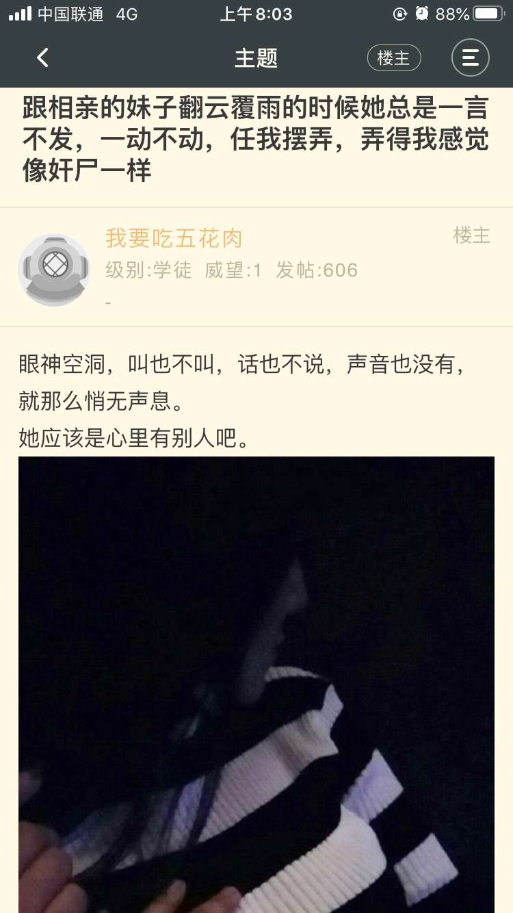
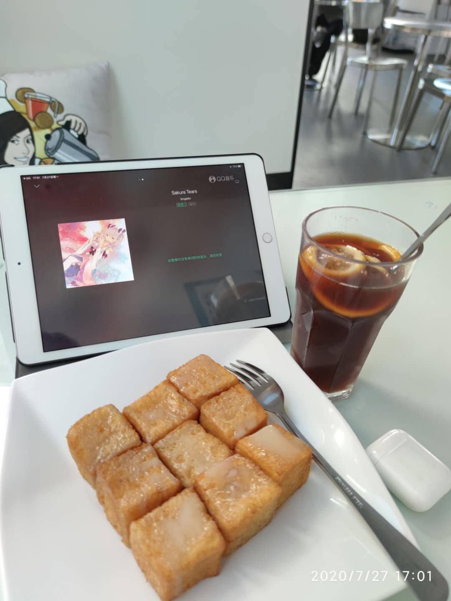

---

title: 22至23岁，所有的经历与情感如风飘过。
date: 2020-07-29 09:12:24
tags: [人生感悟]		
qrcode: false
---

#  韬桑，家乡的Sakura盛开啦，没有猫，也没她，哦哦~

<!-- 简单示例 (id, server, type)  -->


# 瞎扯......未完待续

​        怎么说呢，2019年7月之后每一天日子都过的十分浑浑噩噩，社畜的这一年，经历了很多事，工作上，社交上，亲情，友情等等，全身心疲惫，精神上已经十分麻木，很多事情对我来说已经觉得不值一提，但我还是要保持着年轻人该有的热情与朝气。

​      作为一个年轻人，抱怨是没有用的，唯一能做的就是振作，努力，抛弃沮丧，让变得更强大，人生短短几个秋，开心也是24小时，不开心也是24小时，一定要每天都开开心心的。

​     这个世界很多事情是不公平的，怎么可能公平？不要太天真。

​    转移一下你的注意力吧哥们，以后真碰到你想爱的人你没有那个能力再后悔就来不及了。   

  

​      从大一下学期开始熬夜，到现在很多年了，每天的平均睡眠时间不足5小时，确实能感受到明显智商下降，脑袋的反应能力下降，很多算法题看题解要看很久才明白，阅读文章、邮件、书籍的速度也很慢，经常要回读，引以为戒，要早睡才行了。(您是不是因为太软弱了，所以才如此骄傲地来炫耀自己的痛苦？)

​     

​														繁华的奢侈品店，不知道什么时候能从容进去买东西。

​															深圳群今早分享的一个有意思的图。

我最喜欢的就是港式茶餐厅里的甜点，冻柠茶，鸳鸯奶茶，柠檬红茶。

#  插入

以后想到什么再加,多谢观看。

#  最后就以王靖雯的天籁之音收尾吧

<iframe src="//player.bilibili.com/player.html?aid=20993842&bvid=BV1XW411u7ZR&cid=34421821&page=1" scrolling="no" border="0" frameborder="no" framespacing="0" allowfullscreen="true" > 
    </iframe>

> 来又如风，离又如风，或世事通通不过是场梦。 

<!--  -->