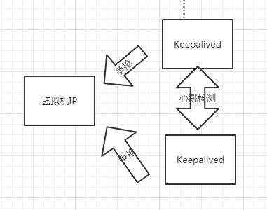

# **WEB高性能的解决方案**

CDN - 高效的磁盘IO处理能力

七层/四层负载均衡： 高效的网络协议处理能力

- 正向代理
- 反向代理

整合Lua语言的负载均衡： 丰富而完善的生态

- API网关

- Waf防火墙

  

# **Nginx-worker分流**

​	nginx是多进程，防止某个线程引用错误的地址空间，地址越界导致整个Nginx崩掉。nginx进程重启，更新nginx.conf，配置脚本更新,nginx -s reload，老worker进程在现存的连接结束后，再优雅地切换成新worker进程。


# **Nginx-Location 范例**

Location配置块定义具体的uri应该如何想要

- = 精确匹配 优先级1
- ^~ 非正则匹配 优先级2
- ~ 区分大小写的正则匹配  优先级3
- **~* 不区分大小写的正则匹配 优先级3**
- / 通用匹配 优先级4

"/" ——>  location = / {[ configuration A]}

"index.html"  ——>  location  / {[ configuration B]}

"/documents/document.html" ——>  location  /documents/  {[ configuration C]}

"/images/1.gif"   ——>  location ^~ /images/  {[ configuration D]}

"/documents/1.jpg" ——>  location ~*  \.(gif|jpg|png)$   {[ configuration E]}

优先级越低的应该写在最前面


# **Nginx-upstream负载策略**

Syntax: server 轮询| weight | ip_hash | least_conn

- 轮询：默认的负载均衡策略，每个请求按照时间顺序逐一分配到不通的后端服务器
- weight： 权重方式，在轮询的策略基础上制定轮询的几率
- ip_hash: 基于客户端IP的分配方式，确保相同的客户端请求一直发到相同的服务器，保证session会话
- least_conn: 把请求转发给连接数较少的后端服务器


# **Nginx-健康检查**

​	Nginx默认使用**被动健康检查**

​	fail_timeout时间内出现max_fails次错误

​	server就被标记为不可用，并惩罚fail_timeout时间不分发请求过来；

​	即： 30s内出现10次错误server即不可用，30s后重新探测一次

**注： 全部upstream server挂掉后，立刻一次性恢复**

​	connect refuse 和 timeout 永久性错误，proxy_next_upstream选择性定义错误

​	timeout 控制指令  ：

1. ​    proxy_connect_timeout： 建链_三次握手时间
2. ​    proxy_read_timeout ：     建链成功_等待后端服务器响应时间_后端服务器处理请求的时间
3.    proxy_send_timeout ： 数据回传间隔时间_网络卡时相邻两次数据传输间隔时间


# **Nginx-动态缓存**

proxy_cache	tmp-test;  										  缓存的目录

proxy_cache_valid	200 206 304 301 302 1d;	返回制定状态码的内容被缓存，缓存时间1天

proxy_cache_key	$uri;


location ~ /purge(/.*) {   				-----将/purge/$1 对应的 

​																/tmp-test/$1 缓存文件清理

​		allow all;

​		proxy_cache_purge temp-test $1;

​		header_filter-by_lua 'ngx.header["Server"] = "xxxx"'

}

# **Nginx-会话保持**

Syntax ： sticky [name=rotes] [domain=.foo.bar] [path=/]

​							[expires=1h] [hash=index|md5|sha1] [no_fallback]

​							[secure] [httponly]


- name 记录会话的cookie名称；

- domain 设置cookie作用的域名；

- path 设置cookie作用的url路径，默认根目录；

- expires 设置cookie生存周期，默认不设置，浏览器关闭失效

- hash 设置cookie中服务器的表示使用明文还是MD5值，默认MD5；

- no_fallback 设置该选项, 当sticky的后端机器挂了以后，nginx返回502，而不
  转发到其他服务器，不建议设置

- secure 设置启用安全的cookie，需要https的支持

- httponly 允许cookie不通过JS泄露

  

# **Nginx-waf**

Web应用程序防火墙（WAF），GAP-Nginx通过第三方扩展模块方式集成ModSecurity，为应用提供WAF能力，弥补应用防护空缺，ModSecurity主要功能：

- 防止SQL注入攻击，交叉站点脚本攻击（XSS)等
- 并行文本匹配
- Lua扩展API为开发者提供一个脚本平台以实现用于保护Web应用的复杂逻辑
- 开启waf功能，Nginx收到的每个HTTP请求都会进过waf本地规则库进行扫描，损失性能与启用的防护规则数量相关。	

   server {

​	listen 8090;

​    modsecurity on;

}

# **部署方式-主备高可用**

​	HA高可用方案是指采用主从热备的部署方式，一主一从，主服务器宕机，从服务器可以接替主服务器提供服务，从而实现高可用。为了实现主从热备部署，有需要使用keepalive的检测软件。从服务检测主服务的健康状态，在从服务发现主服务故障时，从服务夺取主服务对外提供服务的IP地址（VIP)，从服务对外服务，故障主服务不再收到服务请求，实现流量接入高可用。

# **keepalived工作原理**



定义： **（维基百科）**

​	存活信号通常以一定的时间间隔发出，其在[互联网](https://zh.wikipedia.org/wiki/互联网)上扮演了至关重要的角色。若一端在信号发出后未收到回复，则可判定[数据链路](https://zh.wikipedia.org/wiki/数据链路)离线并将之后的数据包重新路由到其他链路，直到旧链路重新上线为止。存活信号也可表示保留连接状态。若无存活信号，启用[网络地址转换](https://zh.wikipedia.org/wiki/网络地址转换)的[路由器](https://zh.wikipedia.org/wiki/路由器)将于超时后中断连接。

​	由于存活信息仅用于表示链路状态及保留连接，其应言简意赅且仅仅占用较少的[带宽](https://zh.wikipedia.org/wiki/带宽_(计算机))。但是，存活信息的格式及用法根据传输协议的不同而有所差异。  	


安装主从脚本，检查进程：ps -ef| grep keepalived， 应该有两个keepalived进程。

rpm -ivh  ***.rpm    安装软件

 -i 　显示套件的相关信息。 -h或--hash 　套件安装时列出标记。 -v 　显示指令执行过程。

master不能把vip抢回来，滚动实现，网络抖动情况需要判断原因再切换。

# **部署方式-集群高可用**

​	应用系统的在高流量场景下（TPS>=16000)，推荐使用软负载均衡集群进行部署。负载均衡按照网络层次分成多个层级。四层和七层负载均衡是负载均衡建设的两个主要方面。四层负载均衡是基于网络四层IP和端口的负载均衡，七层负载均衡是基于七层网络协议。


# **Spring cloud gateway**

​	This project provides a library for building an API Gateway on top of Spring MVC. Spring Cloud Gateway aims to provide a simple, yet effective way to route to APIs and provide cross cutting concerns to them such as: security, monitoring/metrics, and resiliency.

# **JWT**

​	JSON WEB Token （JWT) 是一个开放标准（RFC 7519)，它定义了一种紧凑和自包含的方式，用于在各方之间作为json对象安全的传输信息，此信息可以通过数字签名进行验证和信任。

​	JWT 的原理是，服务器认证以后，生成一个 JSON 对象，发回给用户，就像下面这样。

> ```javascript
> {
>   "姓名": "张三",
>   "角色": "管理员",
>   "到期时间": "2018年7月1日0点0分"
> }
> ```

以后，用户与服务端通信的时候，都要发回这个 JSON 对象。服务器完全只靠这个对象认定用户身份。为了防止用户篡改数据，服务器在生成这个对象的时候，会加上签名（详见后文）。

服务器就不保存任何 session 数据了，也就是说，服务器变成无状态了，从而比较容易实现扩展。

