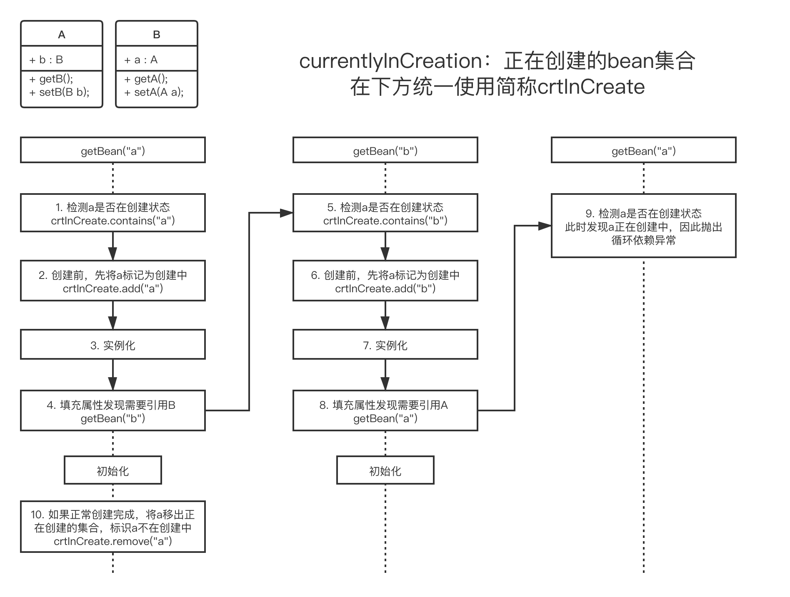
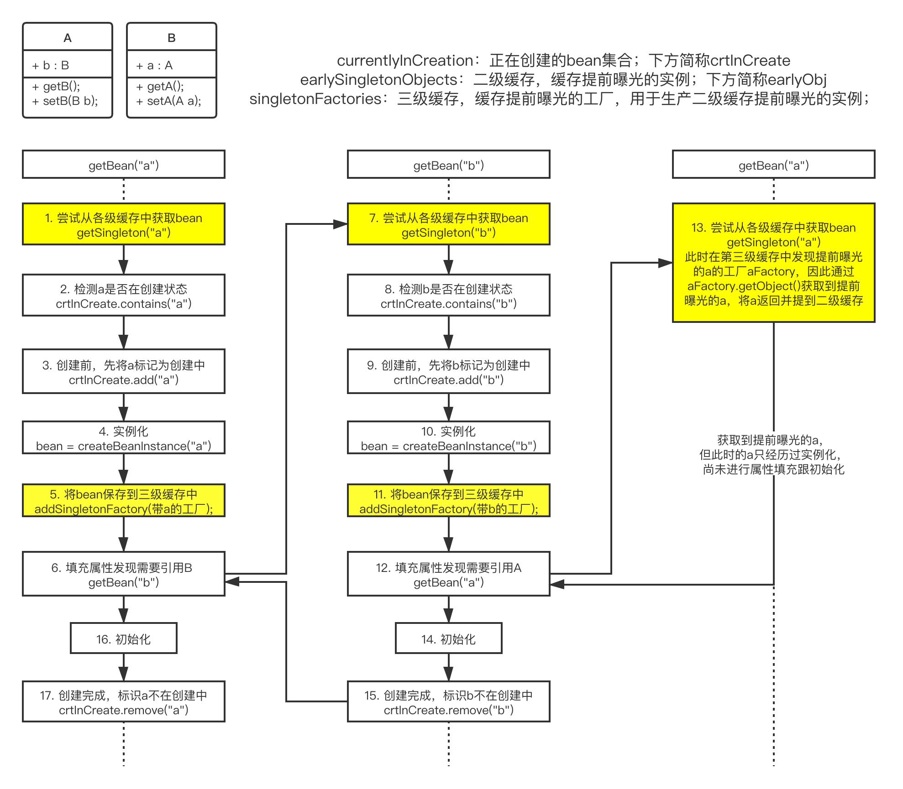
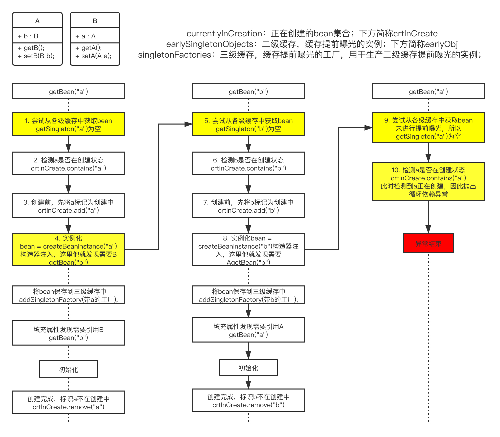

# 前言

想彻底弄清楚spring的循环依赖问题，首先得弄清楚

1. 循环依赖是如何发生的，spring又是如何检测循环依赖的发生的。
2. 其次再探究spring如何解决循环依赖的问题

最后我们将总结循环依赖解决的2个关键因素，`提前曝光`和`曝光时机`，缺一不可

# 1. 循环依赖检查

```xml
<bean id="a" class="A">
	<property name="b" ref="b">
<bean/>
<bean id="b" class="B">
	<property name="a" ref="a">
<bean/>
```

无论单例还是原型模式(下文①代表图中步骤1)，spring都有对应的集合保存当前正在创建的beanName，标识该beanName正在被创建。在bean创建前，①检测当前bean是否在创建中，如果不在创建中则②将beanName加入集合，往下创建bean。在bean创建前，检测到当前的bean正在创建，则说明发生循环依赖，抛出异常。最后记得当bean创建完时将beanName移出集合。



# 2. 循环依赖的处理

## 单例setter循环依赖

spring注入属性的方式有多种，但是只有一种循环依赖能被解决：setter依赖注入。前面或多或少都提到了spring解决循环依赖的做法是未等bean创建完就先将实例曝光出去，方便其他bean的引用。同时还提到了三级缓存，最先曝光到第三级缓存singletonFactories中。简单的说，就是spring先将创建好的实例放到缓存中，让其他bean可以提前引用到该对象。不知道三级缓存是什么的可以参考下(不懂问题也不大)：

[spring从缓存中获取bean]: https://blog.csdn.net/chaitoudaren/article/details/104833545

### 示例

```java
// 第一种 注解方式
public class A {
	@Autowired
	private B b;
}

public class B {
	@Autowired
	private A a;
}

// ===========================
// 第二种 xml配置方式
public class A {
	private B b;
	// getter setter
}

public class B {
	private A a;
	// getter setter
}

<bean id="a" class="A">
	<property name="b" ref="b">
<bean/>
<bean id="b" class="B">
	<property name="a" ref="a">
<bean/>
```

### 分析



上图我觉得我画的很满意，堪称灵魂画手。其中跟循环依赖检测对比，新添加的几个关键节点已经用黄色标识出来，这里有几个重点给大家画一下。

1.提前曝光，如果用c语言的说法就是将指针曝光出去，用java就是将`引用对象`曝光出去。也就是说即便a对象还未创建完成，但是在④实例化过程中`new A()`动作已经开辟了一块`内存空间`，只需要将该地址抛出去b就可以引用的到，而不管a后期还会进行初始化等其他操作

2.已经了解了提前曝光的作用，而相比而言⑤`曝光的时机`也非常的重要，该时机发生在④`实例化`之后，`⑥填充与⑯ 初始化`之前。spring循环依赖之所以不能解决实例化注入的原因正式因为注入时机在曝光之前所导致

3.⑤中写的带a的工厂是什么东西？先来了解一下ObjectFatory

```java
public interface ObjectFactory<T> {
	T getObject() throws BeansException;
}
```

就是一个接口，通过重写getObject()方法返回对应的object

```java
// 将该bean提前曝光，具体做法是创建一个ObjectFactory对象，再将对象加入到singletonFactories缓存中
addSingletonFactory(beanName, () -> getEarlyBeanReference(beanName, mbd, bean));
```

让我帮大家改写一下，不然可能看了有点懵逼，以上代码等同于

```java
addSingletonFactory(beanName, new ObjectFactory<Object>() {
    @Override
	public Object getObject() throws BeansException {
		getEarlyBeanReference(beanName, mbd, bean);
	} 
});
```

但是我们看到，按原计划重写getObject()应该是直接return bean就行了，为什么还有getEarlyBeanReference是什么鬼？（这点非常重要，但是我看了很多博客甚至书本都完全忽视了这点，如果忽视了这点，那三级缓存将失去意义，直接二级缓存就可以解决提前曝光的问题）

getEarlyBeanReference目的就是为了后置处理，给一个在提前曝光时操作bean的机会，具体要怎么操作bean，那就继承SmartInstantiationAwareBeanPostProcessor重写getEarlyBeanReference方法吧。比如你要System.out.print(“啊啊啊啊,我是” + bean + “，我被曝光且提前引用啦”)也是可以的，关键就在于bean被曝光到三级缓存时并没用使用提前曝光的后置处理，而是当三级缓存被提前引用到二级缓存时才触发！（但是在Spring的源码中，真正实现这个方法的只有AbstractAutoProxyCreator这个类，用于提前曝光的AOP代理。当学习完Ioc AOP全部源码之后，我会给出最终章来解释这个问题

[《当AOP遇上循环依赖》]: https://blog.csdn.net/chaitoudaren/article/details/105060882


```java
protected Object getEarlyBeanReference(String beanName, RootBeanDefinition mbd, Object bean) {
		Object exposedObject = bean;
		if (!mbd.isSynthetic() && hasInstantiationAwareBeanPostProcessors()) {
			for (BeanPostProcessor bp : getBeanPostProcessors()) {
				if (bp instanceof SmartInstantiationAwareBeanPostProcessor) {
					SmartInstantiationAwareBeanPostProcessor ibp = (SmartInstantiationAwareBeanPostProcessor) bp;
					// 这么一大段就这句话是核心，也就是当bean要进行提前曝光时，
					// 给一个机会，通过重写后置处理器的getEarlyBeanReference方法，来自定义操作bean
					// 值得注意的是，如果提前曝光了，但是没有被提前引用，则该后置处理器并不生效!!!
					// 这也正式三级缓存存在的意义，否则二级缓存就可以解决循环依赖的问题
					exposedObject = ibp.getEarlyBeanReference(exposedObject, beanName);
				}
			}
		}
		return exposedObject;
	}
```

## 单例构造器注入循环依赖

上面已经剧透了这个方式是不得行的，原因是依赖注入的时间点不对，他的依赖注入发生在构造器阶段，这个时候连实例都没有，内存都还没开辟完，当然也还没有进行提前曝光，因此不得行

### 示例

```java
public class A {
	private B b;

	@Autowired
	public A(B b) {
		this.b = b;
	}
}

public class B {
	private  A a;

	@Autowired
	public B(A a) {
		this.a = a
	}
}
```

### 分析




图上重点地方也用黄色标出了，问题的原因处在④实例化，实例化的过程是调用`new A(B b);`的过程，这时的A还`未创建`出来，根本是不可能`提前曝光`的，正是这个原因导致⑨无法获取到三级缓存，进而导致⑩`异常的抛出`

## 原型模式循环依赖

这此没有图了，因为原型模式每次都是重新生成一个全新的bean，根本没有缓存一说。这将导致实例化A完，填充发现需要B，实例化B完又发现需要A，而每次的A又都要不一样，所以死循环的依赖下去。唯一的做法就是利用`循环依赖检测`，发现原型模式下存在循环依赖并`抛出异常`

# 总结

总结一下循环依赖，spring只能解决setter注入单例模式下的循环依赖问题。要想解决循环依赖必须要满足2个条件：

1. 需要用于`提前曝光`的缓存
2. 属性的`注入时机`必须发生在`提前曝光`动作之后，不管是`填充`还是`初始化`都行，总之不能在`实例化`，因为提前曝光动作在实例化之后

理解了这2点就可以轻松驾驭循环依赖了。比如构造器注入是不满足第二个条件，曝光时间不对。而原型模式则是缺少了第一个条件，没有提前曝光的缓存供使用


转自CSDN： https://blog.csdn.net/chaitoudaren/article/details/104833575?utm_medium=distribute.pc_relevant.none-task-blog-BlogCommendFromMachineLearnPai2-2.nonecase&depth_1-utm_source=distribute.pc_relevant.none-task-blog-BlogCommendFromMachineLearnPai2-2.nonecase

 